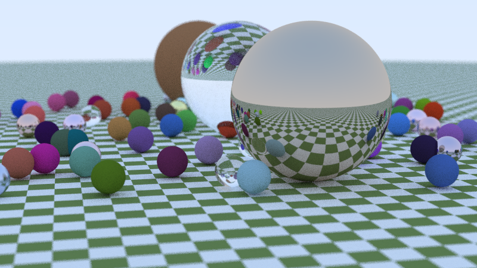
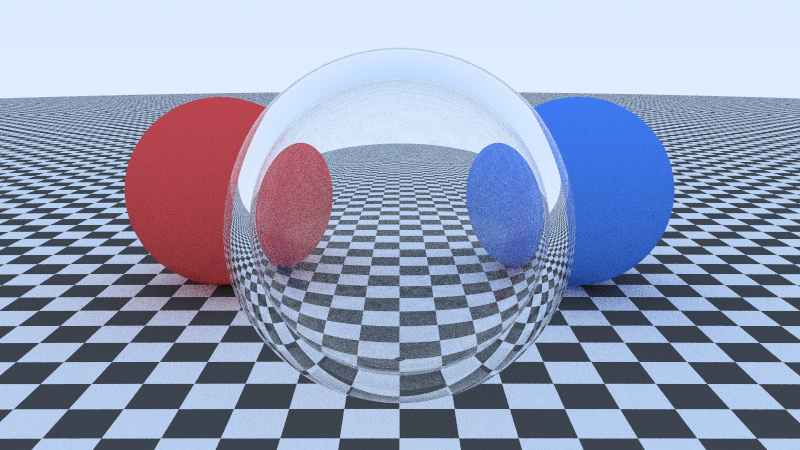
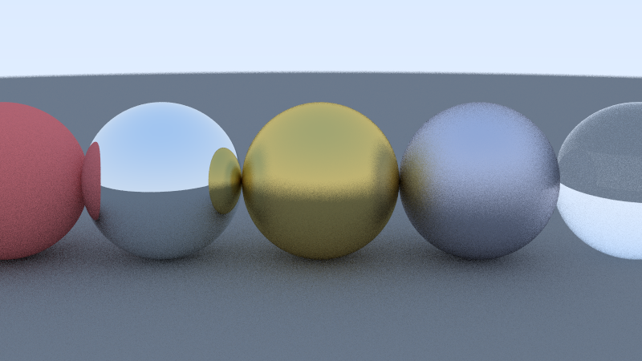
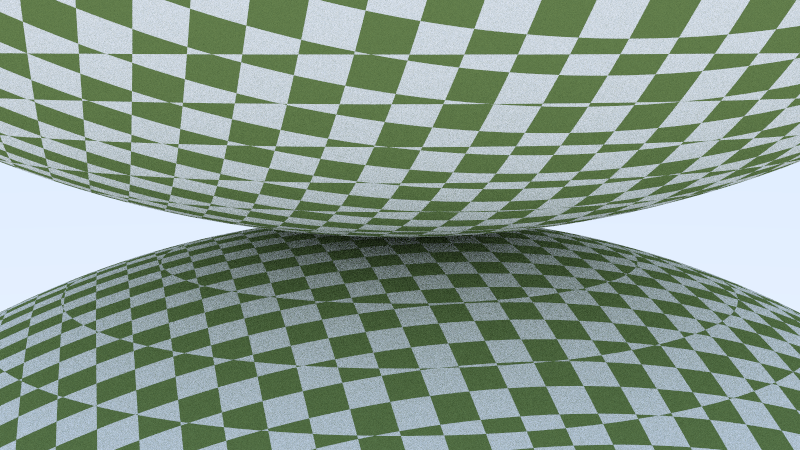
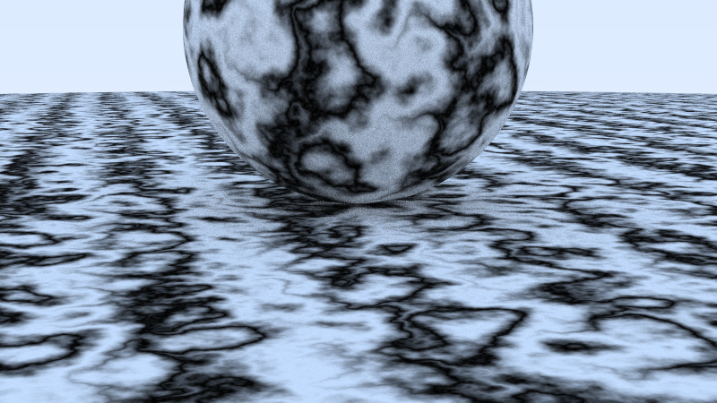

# CppRayTracer

> A CPU ray tracer built from scratch in modern C++ to explore computer graphics, geometry, materials and rendering algorithms.



[](https://github.com/led-21/CppRayTracer/actions/workflows/ci.yml)
[](https://en.wikipedia.org/wiki/C%2B%2B20)
[](LICENSE)
[]()

---

## Table of Contents

- [Overview](#overview)
- [Gallery](#gallery)
- [Features](#features)
- [Rendering Pipeline](#rendering-pipeline)
- [Architecture](#architecture)
- [Mathematics](#mathematics)
- [Materials](#materials)
- [Building](#building)
- [Usage](#usage)
- [Tests](#tests)
- [Performance](#performance)
- [Project Structure](#project-structure)
- [Origins & References](#origins--references)
- [Roadmap](#roadmap)

---

## Overview

**CppRayTracer** is an independent, high-performance CPU ray tracer written in modern C++ (C++20). The engine implements physically-based optics, Monte Carlo path tracing techniques, procedural 3D texturing, spherical UV mapping, and multithreaded scanline execution.

Originally inspired by the educational literature of Peter Shirley's *Ray Tracing in One Weekend*, the codebase has been re-engineered into an extensible, production-quality portfolio demonstrating software architecture, linear algebra, memory safety, test-driven validation, and cross-platform continuous integration.

---

## Gallery

| Showcase Scene | Dielectric Glass Bubble |
| :---: | :---: |
|  |  |
| *~60 random spheres with Lambertian, Metal, and Glass optics* | *Nested concentric spheres showing Snell refraction & Fresnel reflection* |

| Materials & Roughness | Procedural 3D Checker | Turbulent Perlin Marble |
| :---: | :---: | :---: |
|  |  |  |
| *Diffuse, mirror, brushed metal, rough metal, and glass* | *3D coordinate sine-wave checker texture* | *Turbulent Perlin noise with sinusoidal distortion* |

---

## Features

- **Modern C++20 Core:** Clean modular design encapsulated within `namespace raytracer`, leveraging `std::numbers`, `std::clamp`, `constexpr` vector math, and strict RAII.
- **Multithreaded CPU Engine:** Dynamic scanline scheduling across hardware threads using atomic work counters with real-time throughput tracking (MRays/s).
- **Thread-Local PRNG:** Lock-free, 64-bit Mersenne Twister (`std::mt19937_64`) per thread, eliminating global synchronization bottlenecks.
- **Thin-Lens Camera Model:** Configurable look-from, look-at, vertical field of view (vFOV), aperture-based depth of field (defocus blur), and shutter interval.
- **Physically-Based Materials:**
  - **Lambertian:** True diffuse scattering via cosine-weighted unit hemisphere sampling.
  - **Metal:** Specular reflection with adjustable microfacet fuzz parameter.
  - **Dielectric:** Snell's law refraction, total internal reflection, and Schlick's polynomial Fresnel approximation.
- **Texture System & UV Mapping:**
  - Procedural solid colors.
  - 3D spatial checkerboard patterns.
  - Perlin noise with trilinear interpolation and turbulent fractional Brownian motion.
  - Spherical UV surface mapping ($\phi, \theta \to u, v$).
- **RAII Image Pipeline:** Buffer abstraction supporting both **PNG** and ASCII **PPM** output without manual memory management.
- **CLI & Scene Catalog:** Clean command-line interface with 6 built-in scenes and customizable resolution, samples, and bounce depth.
- **Automated Verification:** CTest unit test suite covering vector math, geometry, UV projection, textures, and CLI argument parsing.
- **Cross-Platform CI:** GitHub Actions matrix compiling under Linux (GCC) and Windows (MSVC).

---

## Rendering Pipeline

```
  [Camera]
     │  Generate jittered ray (sub-pixel antialiasing + defocus blur)
     ▼
  [Scene Graph]
     │  Ray-geometry intersection test (Sphere quadratic solver)
     ▼
  [Hit Record] ───► Calculates: Surface Normal, UV Coords, Front/Back Face
     │
     ▼
  [Material Scatter]
     ├── Lambertian  ──► Diffuse reflection + Texture evaluation
     ├── Metal       ──► Specular reflection + Fuzz perturbation
     └── Dielectric  ──► Snell refraction or Total internal reflection (Schlick)
     │
     ▼ (Recursive bounce up to max_depth)
  [Radiance Accumulator]
     │  Sum sample colors
     ▼
  [Post-Processing]
     │  NaN filtering -> Sample scaling -> Gamma 2.0 correction -> Clamping
     ▼
  [ImageBuffer (RAII)] ───► PNG / PPM File Output
```

---

## Architecture

The project adheres to single-responsibility and dependency-inversion principles:

- **`raytracer::core`**: Fundamental types, IEEE 754 float limits, math constants (`std::numbers::pi_v`), and 64-bit thread-local random distribution.
- **`raytracer::math`**: `vec3`, `point3`, `color`, dot and cross products, vector reflection and refraction algorithms.
- **`raytracer::geometry`**: Polymorphic `hittable` base with virtual destructors, `hit_record`, `hittable_list`, and analytical `sphere` intersection.
- **`raytracer::materials`**: `material` interface decoupling geometry from shading (`lambertian`, `metal`, `dielectric`).
- **`raytracer::textures`**: `texture` hierarchy (`solid_color`, `checker_texture`, `noise_texture`, `image_texture`) with `perlin` noise implemented via `std::array` adhering to the **Rule of Zero**.
- **`raytracer::camera`**: Virtual sensor, view frustum transformation ($u, v, w$ orthonormal basis), and thin-lens optics.
- **`raytracer::renderer`**: Multithreaded scanline integrator, `ImageBuffer` abstraction, and terminal telemetry.
- **`raytracer::scene`**: Factory producing self-contained, reproducible test scenes.

---

## Mathematics

### 1. Ray-Sphere Analytical Intersection
A ray is parameterized as:
$$\mathbf{P}(t) = \mathbf{A} + t\mathbf{B}$$
A sphere centered at $\mathbf{C}$ with radius $r$ satisfies:
$$(\mathbf{P} - \mathbf{C}) \cdot (\mathbf{P} - \mathbf{C}) = r^2$$
Substituting the ray equation yields a quadratic in $t$:
$$t^2 (\mathbf{B} \cdot \mathbf{B}) + 2t (\mathbf{B} \cdot (\mathbf{A} - \mathbf{C})) + (\mathbf{A} - \mathbf{C}) \cdot (\mathbf{A} - \mathbf{C}) - r^2 = 0$$
Using $b = 2h$ where $h = \mathbf{B} \cdot (\mathbf{A} - \mathbf{C})$, the discriminant simplifies to:
$$D = h^2 - a c$$
Roots are evaluated within the valid interval $[t_{\min}, t_{\max}]$ to reject self-intersection shadow acne ($t_{\min} = 0.001$).

### 2. Spherical UV Parameterization
For a unit normal point $\mathbf{p} = (x, y, z)$ on the sphere surface:
$$\phi = \operatorname{atan2}(-z, x) + \pi, \quad \theta = \operatorname{acos}(-y)$$
Normalized surface coordinates:
$$u = \frac{\phi}{2\pi}, \quad v = \frac{\theta}{\pi}$$

### 3. Snell's Law & Schlick's Approximation
Refraction across dielectric boundaries obeys:
$$\eta_i \sin\theta_i = \eta_t \sin\theta_t$$
When $\frac{\eta_i}{\eta_t} \sin\theta_i > 1$, refraction is physically impossible and total internal reflection occurs.
Reflectance $R(\theta)$ at grazing angles is modeled via Schlick's approximation:
$$R_0 = \left(\frac{1 - \eta}{1 + \eta}\right)^2, \quad R(\theta) = R_0 + (1 - R_0)(1 - \cos\theta)^5$$

---

## Materials

| Material | Description | Physics / Behavior |
| :--- | :--- | :--- |
| **Lambertian** | Ideal diffuse matte | Scatters rays randomly over the hemisphere: $\mathbf{d} = \mathbf{n} + \mathbf{v}_{\text{rand}}$. Attenuation evaluated from solid color or procedural texture. |
| **Metal** | Polished or brushed metallic | Specular reflection: $\mathbf{r} = \mathbf{v} - 2(\mathbf{v}\cdot\mathbf{n})\mathbf{n}$. Fuzz parameter $\sigma \in [0, 1]$ perturbs the direction within a unit sphere. |
| **Dielectric** | Glass, water, crystal | Transmits and refracts light. Handles internal air bubbles via negative radius spheres without phase distortion. |

---

## Building

### Requirements
- C++20 compliant compiler:
  - GCC 11+
  - Clang 14+
  - MSVC 19.29+ (Visual Studio 2019/2022)
- CMake 3.20 or newer

### Build Instructions

```bash
# Clone the repository
git clone https://github.com/led-21/CppRayTracer.git
cd CppRayTracer

# Configure build
cmake -S . -B build -DCMAKE_BUILD_TYPE=Release

# Build targets
cmake --build build --config Release
```

The resulting binary `cpp-raytracer` (or `cpp-raytracer.exe` on Windows) is generated in `build/bin/` (or `build/bin/Release/`).

---

## Usage

```bash
# Display help and available scenes
./build/bin/cpp-raytracer --help

# Render the showcase scene (1280x720, 100 samples)
./build/bin/cpp-raytracer --scene showcase --width 1280 --height 720 --samples 100 --depth 50 --output render.png

# Render the glass refraction bubble
./build/bin/cpp-raytracer --scene dielectric-glass --width 800 --height 450 --samples 50 --output glass.png

# Output directly to PPM format
./build/bin/cpp-raytracer --scene materials --width 640 --height 360 --samples 30 --output render.ppm

# Specify custom thread count (default is all CPU cores)
./build/bin/cpp-raytracer --scene perlin-spheres --threads 8 --output perlin.png
```

### Command-Line Arguments

| Flag | Description | Default |
| :--- | :--- | :--- |
| `--scene <name>` | Scene name (`showcase`, `basic-spheres`, `materials`, `dielectric-glass`, `checker-spheres`, `perlin-spheres`) | `showcase` |
| `--width <int>` | Image width in pixels | `800` |
| `--height <int>` | Image height in pixels (0 = auto 16:9) | `0` |
| `--samples <int>` | Anti-aliasing samples per pixel | `50` |
| `--depth <int>` | Maximum ray bounce depth | `50` |
| `--threads <int>` | Number of worker threads (0 = all logical cores) | `0` |
| `--output <path>` | Destination file path (`.png` or `.ppm`) | `render.png` |
| `-h`, `--help` | Show command usage and scene list | — |

---

## Tests

The project includes unit tests integrated with **CTest**:

```bash
# Run all test suites
ctest --test-dir build -C Release --output-on-failure
```

### Test Coverage
- `TestVec3`: Vector addition, subtraction, dot product, cross product, normalization, ray propagation $P(t)$.
- `TestGeometry`: Ray-sphere intersection roots, surface normal orientation, front-face detection, spherical UV coordinates.
- `TestTextures`: Procedural 3D checker evaluation, Perlin noise boundedness, and Perlin Rule-of-Zero copy/assignment integrity.
- `TestImageBuffer`: Memory layout, pixel clamping, gamma-2 encoding, ASCII PPM streaming.
- `TestCliAndScenes`: Complete command-line flag parser and instantiation verification for all 6 catalog scenes.

---

## Performance

The multithreaded renderer uses dynamic atomic scanline distribution, maximizing core saturation across CPU architectures:

```text
========================================
 CppRayTracer - Multithreaded Renderer
========================================
 Scene:          showcase
 Resolution:     800x450
 Samples/pixel:  50
 Max depth:      50
 Threads:        20
 Output:         renders/showcase.png
========================================

Rendering progress: 100% (450/450 scanlines) 

Performance Metrics:
  Elapsed Time:       4.62 seconds
  Primary Rays Cast:  18000000
  Ray Throughput:     3.90 MRays/s
```

*Benchmark executed on Windows 11 x86_64, 20 logical threads.*

---

## Project Structure

```
CppRayTracer/
├── CMakeLists.txt                # Modern CMake root configuration
├── LICENSE                       # MIT License
├── THIRD_PARTY_NOTICES.md        # Third-party attribution & notices
├── README.md                     # Technical documentation
├── .gitignore                    # Build and artifact exclusions
│
├── .github/
│   └── workflows/
│       └── ci.yml                # Linux & Windows GitHub Actions CI
│
├── include/
│   └── raytracer/
│       ├── camera/
│       │   └── camera.hpp        # Thin-lens depth-of-field camera
│       ├── core/
│       │   ├── cli.hpp           # Lightweight CLI parser
│       │   ├── constants.hpp     # Math constants & C++20 std::numbers
│       │   ├── random.hpp        # Thread-local 64-bit Mersenne Twister PRNG
│       │   └── ray.hpp           # Parametric ray definition
│       ├── geometry/
│       │   ├── hittable.hpp      # Polymorphic surface base & hit_record
│       │   ├── hittable_list.hpp # Geometric object aggregate
│       │   └── sphere.hpp        # Analytical sphere & spherical UV mapping
│       ├── materials/
│       │   └── material.hpp      # Lambertian, Metal, and Dielectric optics
│       ├── math/
│       │   ├── color.hpp         # Color operations & gamma correction
│       │   └── vec3.hpp          # Vector3 arithmetic & optics utilities
│       ├── renderer/
│       │   ├── image_buffer.hpp  # RAII image memory & PNG/PPM writers
│       │   └── renderer.hpp      # Multithreaded integrator & telemetry
│       ├── scene/
│       │   ├── scene.hpp         # Scene definition & camera bundle
│       │   └── scene_factory.hpp # Modular catalog of 6 demo scenes
│       └── textures/
│           ├── perlin.hpp        # Trilinear Perlin noise & turbulence
│           └── texture.hpp       # Texture interface, Checker & Image texture
│
├── src/
│   └── main.cpp                  # CLI entry point
│
├── tests/
│   ├── CMakeLists.txt            # CTest suite registration
│   ├── test_cli_and_scenes.cpp   # CLI & scene catalog tests
│   ├── test_geometry.cpp         # Sphere collision & UV mapping tests
│   ├── test_image_buffer.cpp     # RAII buffer & PPM generation tests
│   ├── test_textures.cpp         # Procedural texture & noise tests
│   └── test_vec3.cpp             # Linear algebra & ray math tests
│
├── third_party/
│   └── stb/
│       ├── stb_image.h           # Single-header image reader
│       ├── stb_image_write.h     # Single-header image writer
│       └── stb_impl.cpp          # Isolated compilation unit for STB macros
│
├── assets/                       # Textures & input assets
├── renders/                      # Rendered gallery showcase images
└── docs/                         # Additional architecture notes
```

---

## Origins & References

> *"This project originated as an implementation inspired by the Ray Tracing in One Weekend series and has since evolved into an independent C++ ray tracing playground."*

- **Peter Shirley, Trevor David Black, Steve Hollasch:** [Ray Tracing in One Weekend Series](https://raytracing.github.io/) (CC0 1.0 Universal).
- **Sean T. Barrett:** [stb single-file public domain libraries](https://github.com/nothings/stb) (MIT / Public Domain).
- **Matt Pharr, Wenzel Jakob, Greg Humphreys:** *Physically Based Rendering: From Theory to Implementation* (PBRT).

---

## Roadmap

- [x] Modern C++20 architecture and clean namespace encapsulation.
- [x] RAII image buffer with PNG and PPM exporters.
- [x] Multi-material optics (Lambertian, Metal, Dielectric).
- [x] Procedural textures and Perlin noise marble effect.
- [x] Multi-scene catalog and lightweight CLI interface.
- [x] Multithreaded scanline rendering with dynamic atomic scheduling.
- [x] CTest unit testing framework and GitHub Actions CI.
- [ ] Bounding Volume Hierarchy (BVH) for $O(\log N)$ ray-primitive intersection.
- [ ] Triangle meshes and OBJ file loader.
- [ ] Quad, disk, and cylinder analytical primitives.
- [ ] Area light sources and importance sampling (Monte Carlo NEE).
